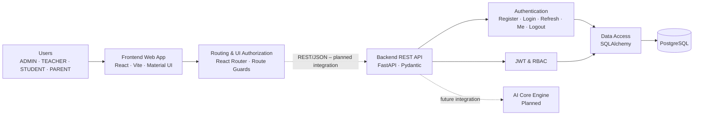

# SDD – Phần IV, Mục 1: Thiết kế Kiến trúc Hệ thống

## 1.1. Thông tin tài liệu

| Thuộc tính | Giá trị |
|---|---|
| Tên hệ thống | Nền tảng học tập cá nhân hóa và luyện thi ĐGNL tích hợp AI |
| Tên tài liệu | System Architecture Design |
| Phần | SDD Phần IV – Mục 1 |
| Phiên bản | 1.0 |
| Trạng thái | Bản nháp phục vụ review |
| Phạm vi mã nguồn | Nhánh `main` tại thời điểm biên soạn |

## 1.2. Mục đích

Tài liệu này đặc tả kiến trúc tổng quan của hệ thống, trách nhiệm của từng lớp, quan hệ giữa các thành phần, cơ chế giao tiếp, ranh giới bảo mật và định hướng triển khai. Tài liệu là cơ sở để:

- thống nhất cách Frontend, Backend và Database phối hợp;
- hỗ trợ các thành viên phát triển module mới mà không phá vỡ ranh giới kiến trúc;
- làm đầu vào cho thiết kế chi tiết, đặc tả API, kiểm thử tích hợp và triển khai;
- phân biệt rõ thành phần đã hiện diện trong mã nguồn với thành phần dự kiến.

## 1.3. Phạm vi và trạng thái triển khai

### 1.3.1. Thành phần hiện có

Repository hiện được tổ chức thành ba phần cấp cao:

| Thành phần | Công nghệ chính | Trạng thái |
|---|---|---|
| `Frontend/` | React 19, Vite, Material UI, React Router | Đã có khung giao diện, router, layout và phân quyền giao diện giả lập |
| `Backend/` | FastAPI, Pydantic, SQLAlchemy, JWT | Đã có Authentication API, JWT và RBAC |
| `Database/` | PostgreSQL, SQL DDL/Migration/Index | Đã có schema nền tảng và tài liệu kiến trúc CSDL |

### 1.3.2. Thành phần chưa hoàn tất

- Frontend chưa gọi Backend API; trạng thái đăng nhập hiện được mô phỏng bằng `AuthContext` và `localStorage`.
- AI Core Engine chưa có mã nguồn trong repository.
- Các trang Assessment, Learning Roadmap, Practice, AI Tutor, Analytics, Question Bank và Knowledge Base mới là giao diện placeholder; chưa có API nghiệp vụ tương ứng.
- SQLAlchemy hiện mới ánh xạ đầy đủ bảng `users`; các bảng nghiệp vụ khác được định nghĩa trong SQL nhưng chưa có ORM model trong Backend.

Các thành phần chưa hoàn tất chỉ được mô tả như kiến trúc mục tiêu, không được xem là chức năng đã triển khai.

## 1.4. Mục tiêu và nguyên tắc kiến trúc

Kiến trúc được thiết kế theo các nguyên tắc sau:

1. **Phân tách trách nhiệm:** Frontend xử lý trình bày; Backend xử lý nghiệp vụ, xác thực và truy cập dữ liệu; PostgreSQL quản lý dữ liệu bền vững.
2. **API-first:** mọi giao tiếp giữa client và server đi qua REST API; Frontend không truy cập trực tiếp Database.
3. **Backend là cổng kiểm soát:** xác thực, phân quyền, kiểm tra dữ liệu và điều phối nghiệp vụ được thực hiện tại Backend.
4. **Single Source of Truth:** các file trong `Database/sql/` là nguồn chuẩn cho schema quan hệ; ORM phải tương thích với schema này.
5. **Least privilege:** người dùng chỉ được truy cập tài nguyên phù hợp với role.
6. **Khả năng mở rộng:** các module nghiệp vụ và AI được tích hợp qua Backend mà không làm client phụ thuộc trực tiếp vào hạ tầng nội bộ.
7. **Trung thực với hiện trạng:** tài liệu phải phân biệt dependency đã triển khai và dependency dự kiến.

## 1.5. Kiến trúc tổng quan

Hệ thống áp dụng kiến trúc phân lớp gồm Client Layer, Presentation Layer, Application Layer và Data Layer. AI Core Engine là thành phần mở rộng dự kiến của Application/AI Layer.



Sơ đồ Draw.io, PNG và SVG chi tiết được quản lý tại `Docs/Diagram/Architecture/` sau khi PR kiến trúc được tích hợp.

## 1.6. Mô tả các lớp kiến trúc

### 1.6.1. Client Layer

Client Layer đại diện cho người sử dụng hệ thống qua trình duyệt web. Hệ thống định nghĩa bốn role:

- `ADMIN`: quản trị tài khoản và cấu hình hệ thống;
- `TEACHER`: quản lý câu hỏi, kho tri thức và phân tích học sinh;
- `STUDENT`: đánh giá năng lực, học theo lộ trình, luyện tập và sử dụng AI Tutor;
- `PARENT`: theo dõi tiến độ của học sinh.

Role không phải là service độc lập. Role được dùng làm dữ liệu đầu vào cho cơ chế điều hướng giao diện và kiểm soát truy cập Backend.

### 1.6.2. Presentation Layer

Presentation Layer được triển khai trong `Frontend/src/` với các trách nhiệm:

- hiển thị giao diện bằng React và Material UI;
- định tuyến bằng React Router;
- cung cấp layout chung gồm Header, Sidebar và vùng nội dung;
- giới hạn route theo trạng thái đăng nhập và role;
- hiển thị trang 404 và trang từ chối truy cập;
- chuẩn bị điểm tích hợp REST API trong giai đoạn tiếp theo.

Các package chính:

| Package | Trách nhiệm |
|---|---|
| `routes` | Khai báo route và ánh xạ route tới page |
| `components/layout` | Header, Sidebar và MainLayout |
| `contexts` | Trạng thái xác thực dùng chung trong Frontend |
| `guards` | ProtectedRoute và RoleRoute |
| `config` | Theme, role và cấu hình menu |
| `pages` | Các page theo role và page dùng chung |

`AuthContext` hiện tạo mock user và lưu vào `localStorage`. Cơ chế này chỉ phục vụ kiểm tra giao diện; không thay thế Authentication API của Backend.

### 1.6.3. Application Layer

Application Layer được triển khai trong `Backend/app/` bằng FastAPI. Đây là ranh giới tin cậy chính của hệ thống và chịu trách nhiệm:

- tiếp nhận request HTTP/JSON;
- kiểm tra request schema bằng Pydantic;
- xác thực mật khẩu và JWT;
- kiểm tra role bằng RBAC;
- truy vấn/cập nhật dữ liệu qua SQLAlchemy;
- trả response JSON và mã trạng thái HTTP phù hợp.

Các module hiện có:

| Module | Trách nhiệm |
|---|---|
| `main.py` | Khởi tạo FastAPI app, đăng ký router và health endpoint |
| `api.py` | Register, Login, Refresh, Me và Logout |
| `routes.py` | Các endpoint kiểm tra quyền RBAC |
| `rbac.py` | Đọc user từ access token và yêu cầu role |
| `schemas.py` | Request/response model bằng Pydantic |
| `models.py` | SQLAlchemy model và enum người dùng |
| `db.py` | Engine, session và dependency database |
| `core/security.py` | Hash/verify mật khẩu, tạo và giải mã JWT |
| `core/config.py` | Cấu hình từ biến môi trường và `.env` |

### 1.6.4. Data Layer

Data Layer sử dụng PostgreSQL. Schema hiện định nghĩa:

- `users`: người dùng, role và trạng thái;
- `questions`: ngân hàng câu hỏi;
- `tests`: phiên đánh giá/làm bài;
- `user_answers`: câu trả lời của người dùng;
- `study_plans`: lộ trình/kế hoạch học;
- `plan_tasks`: nhiệm vụ theo ngày trong kế hoạch.

Quan hệ dữ liệu quan trọng:

- `tests.user_id` tham chiếu `users.id`;
- `user_answers.test_id` tham chiếu `tests.id`;
- `user_answers.question_id` tham chiếu `questions.id`;
- `study_plans.user_id` tham chiếu `users.id`;
- `plan_tasks.plan_id` tham chiếu `study_plans.id`.

Backend hiện phụ thuộc trực tiếp vào bảng `users`. Khi bổ sung model nghiệp vụ, tên bảng, cột, constraint và quan hệ phải bám theo `Database/sql/` hoặc được cập nhật bằng migration có kiểm soát.

### 1.6.5. Planned AI Layer

AI Core Engine dự kiến hỗ trợ đánh giá năng lực, cá nhân hóa lộ trình và đề xuất nội dung. Các nguyên tắc tích hợp:

- Frontend không gọi trực tiếp AI Core;
- Backend cung cấp API và kiểm soát xác thực/phân quyền;
- AI Core chỉ nhận dữ liệu tối thiểu cần thiết;
- dữ liệu nhạy cảm không được đưa vào prompt hoặc log nếu không cần thiết;
- contract cụ thể chỉ được chốt khi module AI có thiết kế và mã nguồn được phê duyệt.

## 1.7. Luồng giao tiếp chính

### 1.7.1. Luồng giao diện hiện tại

1. Người dùng chọn role trên trang Login giả lập.
2. `AuthContext` tạo mock user và lưu vào `localStorage`.
3. `ProtectedRoute` kiểm tra trạng thái đăng nhập.
4. `RoleRoute` kiểm tra role trước khi render page.
5. Sidebar hiển thị menu tương ứng với role.

Luồng này không tạo JWT và không truy cập Backend hoặc PostgreSQL.

### 1.7.2. Luồng đăng nhập mục tiêu

1. Frontend gửi `POST /api/v1/auth/login` với email và password qua HTTPS.
2. Backend tìm user theo email trong PostgreSQL.
3. Backend xác minh Argon2 hoặc legacy bcrypt hash.
4. Nếu user ở trạng thái `ACTIVE`, Backend phát Access Token và Refresh Token.
5. Frontend lưu token bằng cơ chế an toàn được nhóm thống nhất và gửi Access Token trong header `Authorization: Bearer <token>`.
6. Backend xác minh token trước khi xử lý request bảo vệ.

### 1.7.3. Luồng request có RBAC

1. Client gửi request kèm Access Token.
2. Backend kiểm tra chữ ký, `exp` và `type=access`.
3. Backend đọc `sub`, tải user từ bảng `users` và kiểm tra `status=ACTIVE`.
4. Dependency RBAC so sánh role hiện tại với role được phép.
5. Request không hợp lệ trả `401`; thiếu quyền trả `403`; request hợp lệ được chuyển đến handler.

### 1.7.4. Luồng truy cập dữ liệu

1. Route nhận `Session` thông qua dependency `get_db`.
2. SQLAlchemy thực hiện truy vấn trong session.
3. Handler commit khi có thay đổi dữ liệu và refresh entity khi cần.
4. Session được đóng trong khối `finally`.
5. Pydantic chuyển entity được phép thành response; password không xuất hiện trong `UserResponse`.

## 1.8. Hợp đồng API

Backend hiện cung cấp:

| Nhóm | Method và path | Mục đích |
|---|---|---|
| System | `GET /health` | Kiểm tra trạng thái service |
| Authentication | `POST /api/v1/auth/register` | Đăng ký STUDENT |
| Authentication | `POST /api/v1/auth/login` | Nhận token pair |
| Authentication | `POST /api/v1/auth/refresh` | Cấp lại token pair |
| Authentication | `GET /api/v1/auth/me` | Lấy user hiện tại |
| Authentication | `POST /api/v1/auth/logout` | Xác nhận logout phía client |
| RBAC | `GET /api/v1/rbac/admin` | Tài nguyên ADMIN |
| RBAC | `GET /api/v1/rbac/teacher` | Tài nguyên TEACHER/ADMIN |
| RBAC | `GET /api/v1/rbac/student` | Tài nguyên STUDENT/ADMIN |
| RBAC | `GET /api/v1/rbac/parent` | Tài nguyên PARENT/ADMIN |

FastAPI cung cấp Swagger UI tại `/docs`, ReDoc tại `/redoc` và OpenAPI JSON tại `/openapi.json`. Bộ đặc tả và Postman Collection được quản lý tại `Docs/API/` sau khi PR API được tích hợp.

## 1.9. Thiết kế bảo mật

### 1.9.1. Authentication

- Password mới được hash bằng Argon2.
- Dữ liệu mock cũ có thể được xác minh bằng bcrypt.
- JWT chứa `sub`, `role`, `type`, `jti`, `iat` và `exp`.
- Access Token và Refresh Token có mục đích và thời hạn khác nhau.
- Refresh Token không được sử dụng thay cho Access Token.

### 1.9.2. Authorization

Backend là nơi thực thi quyền bắt buộc. Route guard ở Frontend chỉ cải thiện trải nghiệm và không được xem là cơ chế bảo mật.

| Tài nguyên | ADMIN | TEACHER | STUDENT | PARENT |
|---|---:|---:|---:|---:|
| Admin | Có | Không | Không | Không |
| Teacher | Có | Có | Không | Không |
| Student | Có | Không | Có | Không |
| Parent | Có | Không | Không | Có |

### 1.9.3. Cấu hình và bí mật

- `JWT_SECRET_KEY` và thông tin kết nối database phải lấy từ biến môi trường hoặc secret manager.
- Không commit `.env`, mật khẩu hoặc token thật.
- Môi trường triển khai phải sử dụng HTTPS.
- CORS chỉ cho phép các origin frontend được phê duyệt khi tích hợp thật.
- Production nên bổ sung rate limiting, audit log và refresh-token rotation/revocation.

## 1.10. Kiến trúc triển khai đề xuất

```text
Browser
   |
   | HTTPS
   v
Static Frontend / CDN
   |
   | HTTPS REST API
   v
Reverse Proxy / Load Balancer
   |
   v
FastAPI Instance(s)
   |
   | SQLAlchemy / TLS
   v
PostgreSQL
```

Trong môi trường phát triển, Frontend và Backend có thể chạy trên hai port cục bộ khác nhau. Trong production:

- Frontend được build thành static assets;
- reverse proxy kết thúc TLS và chuyển request API đến FastAPI;
- nhiều FastAPI instance có thể chạy phía sau load balancer;
- PostgreSQL không được public trực tiếp ra Internet;
- cấu hình và secret được inject theo môi trường.

AI Core khi được triển khai có thể là internal service riêng; chỉ Backend được phép gọi service này.

## 1.11. Thuộc tính chất lượng

### 1.11.1. Khả năng bảo trì

- Ranh giới `Frontend`, `Backend`, `Database` rõ ràng.
- Router, schema, security và data access được tách theo trách nhiệm.
- OpenAPI là contract chung giữa Frontend và Backend.
- Module nghiệp vụ mới nên được nhóm theo feature khi có đủ page, API và logic riêng.

### 1.11.2. Khả năng mở rộng

- JWT access token được xác minh cục bộ, phù hợp với nhiều Backend instance.
- FastAPI router cho phép bổ sung module API theo prefix/tag.
- AI Core được đặt sau Backend để có thể thay đổi implementation mà không ảnh hưởng trực tiếp client.
- Database index và migration được quản lý tập trung.

### 1.11.3. Hiệu năng

- Login sử dụng email unique/indexed.
- Protected request tải user bằng primary key.
- Static frontend có thể phân phối qua CDN.
- Truy vấn nghiệp vụ phải tránh N+1 và được bổ sung index dựa trên workload thực tế.

### 1.11.4. Tính sẵn sàng và quan sát

- `/health` hỗ trợ health check cơ bản.
- Production cần bổ sung structured logging, request ID, metrics và error monitoring.
- Backup, restore và giám sát PostgreSQL phải được cấu hình độc lập.

### 1.11.5. Khả năng kiểm thử

- Backend có unit/integration tests cho JWT, authentication, RBAC và schema compatibility.
- OpenAPI và Postman hỗ trợ kiểm thử contract thủ công/tự động.
- Frontend cần bổ sung tests cho route guard và API integration ở giai đoạn tiếp theo.

## 1.12. Quyết định kiến trúc

| ID | Quyết định | Lý do | Hệ quả |
|---|---|---|---|
| ADR-01 | React/Vite cho Web Frontend | Phù hợp khung giao diện SPA và tốc độ phát triển | Cần cơ chế API client và quản lý token khi tích hợp |
| ADR-02 | FastAPI cho Backend API | Có Pydantic và sinh OpenAPI tự động | Contract phụ thuộc khai báo schema/route chính xác |
| ADR-03 | PostgreSQL làm relational database | Phù hợp dữ liệu người dùng, bài thi và kế hoạch học có quan hệ | Cần migration, index, backup và connection management |
| ADR-04 | JWT cho authentication | Stateless access token hỗ trợ scale ngang | Cần quản lý refresh/revocation cho production |
| ADR-05 | RBAC với bốn role | Khớp actor chính của hệ thống | Permission nghiệp vụ chi tiết cần mở rộng từ baseline role |
| ADR-06 | Backend làm gateway tới AI | Bảo vệ dữ liệu và giảm coupling phía client | Backend phải quản lý timeout, lỗi và quan sát AI service |

## 1.13. Ràng buộc, giả định và rủi ro

### Ràng buộc

- Backend phải tương thích với schema `users` của Database.
- Role hợp lệ gồm `ADMIN`, `TEACHER`, `STUDENT`, `PARENT`.
- Frontend không được truy cập trực tiếp PostgreSQL.
- API bảo vệ phải yêu cầu Bearer Access Token.

### Giả định

- PostgreSQL được khởi tạo bằng các SQL script/migration đã review.
- Reverse proxy và HTTPS được cấu hình ở môi trường production.
- Danh sách feature nghiệp vụ sẽ được chốt qua Jira/SRS trước khi mở rộng API.

### Rủi ro và biện pháp

| Rủi ro | Ảnh hưởng | Biện pháp |
|---|---|---|
| Frontend mock khác contract Backend | Tích hợp chậm hoặc lỗi | Dùng OpenAPI/Postman làm contract và tích hợp sớm |
| ORM không đồng bộ schema SQL | Lỗi runtime hoặc mất dữ liệu | Migration review và compatibility tests |
| Secret mặc định bị dùng ở production | Token có thể bị giả mạo | Bắt buộc secret mạnh từ secret manager |
| JWT logout chưa có revocation | Token còn hiệu lực sau logout | Token ngắn hạn và bổ sung shared revocation/rotation |
| AI contract chưa chốt | Coupling hoặc phải sửa API | Định nghĩa interface và dữ liệu tối thiểu trước triển khai |
| Thiếu monitoring | Khó phát hiện sự cố | Structured logs, metrics, tracing và alerting |

## 1.14. Truy vết tới mã nguồn và tài liệu

| Nội dung | Nguồn tham chiếu |
|---|---|
| Frontend bootstrap | `Frontend/src/main.jsx`, `Frontend/src/App.jsx` |
| Router và role pages | `Frontend/src/routes/AppRouter.jsx` |
| UI authentication | `Frontend/src/contexts/AuthContext.jsx` |
| Route protection | `Frontend/src/guards/ProtectedRoute.jsx`, `RoleRoute.jsx` |
| FastAPI bootstrap | `Backend/app/main.py` |
| Authentication API | `Backend/app/api.py` |
| JWT và password security | `Backend/app/core/security.py` |
| RBAC | `Backend/app/rbac.py`, `Backend/app/routes.py` |
| API schema | `Backend/app/schemas.py` |
| ORM và database session | `Backend/app/models.py`, `Backend/app/db.py` |
| Database schema | `Database/sql/1_schema.sql` |
| Database architecture | `Database/docs/SDD_Part_III_Database_Architecture.md` |
| Security architecture | `Backend/docs/SDD_Part_IV_Security_Authentication_Architecture.md` |
| High-Level Architecture | `Docs/Diagram/Architecture/` sau khi PR liên quan được merge |
| OpenAPI và Postman | `Docs/API/` sau khi PR liên quan được merge |

## 1.15. Tiêu chí chấp nhận

Tài liệu được xem là đạt khi:

1. mô tả đúng các thành phần đang có trong repository;
2. phân biệt rõ phần hiện trạng và phần dự kiến;
3. thể hiện đúng ranh giới Frontend–Backend–Database;
4. khớp Authentication API, RBAC matrix và database schema hiện tại;
5. có mô tả giao tiếp, bảo mật, triển khai và thuộc tính chất lượng;
6. được đại diện Frontend, Backend, Database và AI review;
7. liên kết được tới High-Level Architecture, Package Diagram và API specification sau khi các tài liệu đó được tích hợp.

## 1.16. Tài liệu liên quan

- SDD Phần III – Kiến trúc Cơ sở dữ liệu.
- SDD Phần IV – Kiến trúc Bảo mật và Xác thực.
- High-Level Architecture Diagram và Package Diagram.
- OpenAPI 3.1 Specification.
- Postman Collection và Local Environment.
- SRS/Jira của nhóm cho các feature nghiệp vụ.
