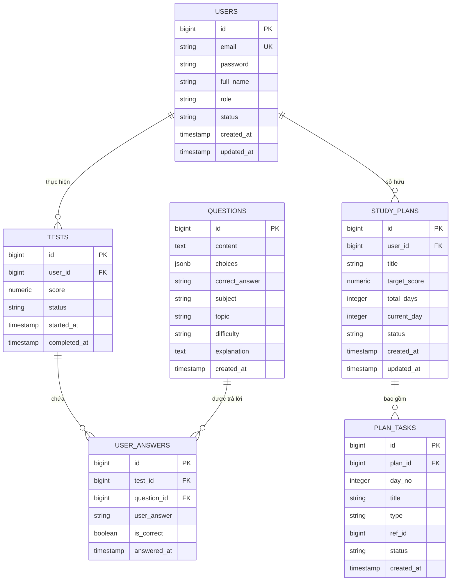

# Sơ đồ Quan hệ Thực thể (ERD) - TASK 2

```mermaid
erDiagram
    USERS ||--o{ TESTS : "thực hiện"
    USERS ||--o{ STUDY_PLANS : "sở hữu"
    TESTS ||--o{ USER_ANSWERS : "chứa"
    QUESTIONS ||--o{ USER_ANSWERS : "được trả lời"
    STUDY_PLANS ||--o{ PLAN_TASKS : "bao gồm"

    USERS {
        bigint id PK
        string email UK
        string password
        string full_name
        string role
        string status
        timestamp created_at
        timestamp updated_at
    }

    QUESTIONS {
        bigint id PK
        text content
        jsonb choices
        string correct_answer
        string subject
        string topic
        string difficulty
        text explanation
        timestamp created_at
    }

    TESTS {
        bigint id PK
        bigint user_id FK
        numeric score
        string status
        timestamp started_at
        timestamp completed_at
    }

    USER_ANSWERS {
        bigint id PK
        bigint test_id FK
        bigint question_id FK
        string user_answer
        boolean is_correct
        timestamp answered_at
    }

    STUDY_PLANS {
        bigint id PK
        bigint user_id FK
        string title
        numeric target_score
        integer total_days
        integer current_day
        string status
        timestamp created_at
        timestamp updated_at
    }

    PLAN_TASKS {
        bigint id PK
        bigint plan_id FK
        integer day_no
        string title
        string type
        bigint ref_id
        string status
        timestamp created_at
    }
```